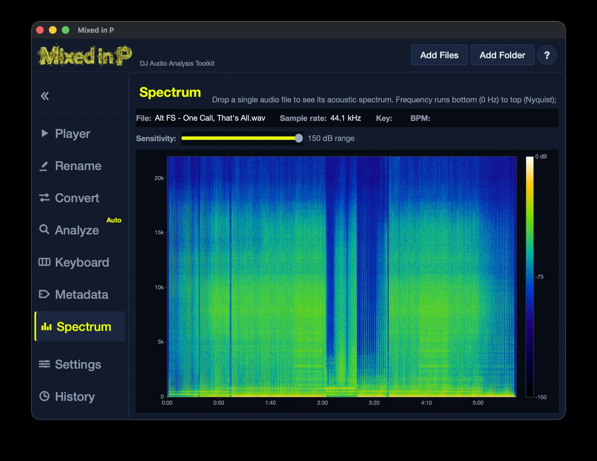

# Mixed in P

DJ audio analysis toolkit for detecting BPM and musical key & Complete file preparation workflow.



## Features

- Batch file renaming with undo
- Audio conversion (MP3/WAV/FLAC/AIFF)
- BPM detection using beat tracking (librosa)
- Key detection using chroma analysis
- Harmonic mixing notation
- Energy level detection
- Auto-write metadata to file tags & Manual metadata editing
- Slicer for sample lifting
- Keyboard to play chords for comparison
- Dark neon theme GUI

## Install

```bash
python -m venv venv
# Windows
venv\Scripts\activate
# macOS/Linux
source venv/bin/activate

pip install -r requirements.txt
```

## Run

```bash
python -m src.main
```

Or use the launcher scripts:
- Windows: `run_app.bat`
- macOS/Linux: `./run_app.sh`

## CLI

```bash
mixed-in-p analyze path/to/music/
mixed-in-p rename path/to/music/ --add-bpm --add-key
```

## Build

```bash
pip install pyinstaller
pyinstaller mixedinp.spec
```

Output: `dist/MixedInP/`

## Supported Formats

MP3, WAV, FLAC, AIFF, M4A, OGG

## License

MIT
