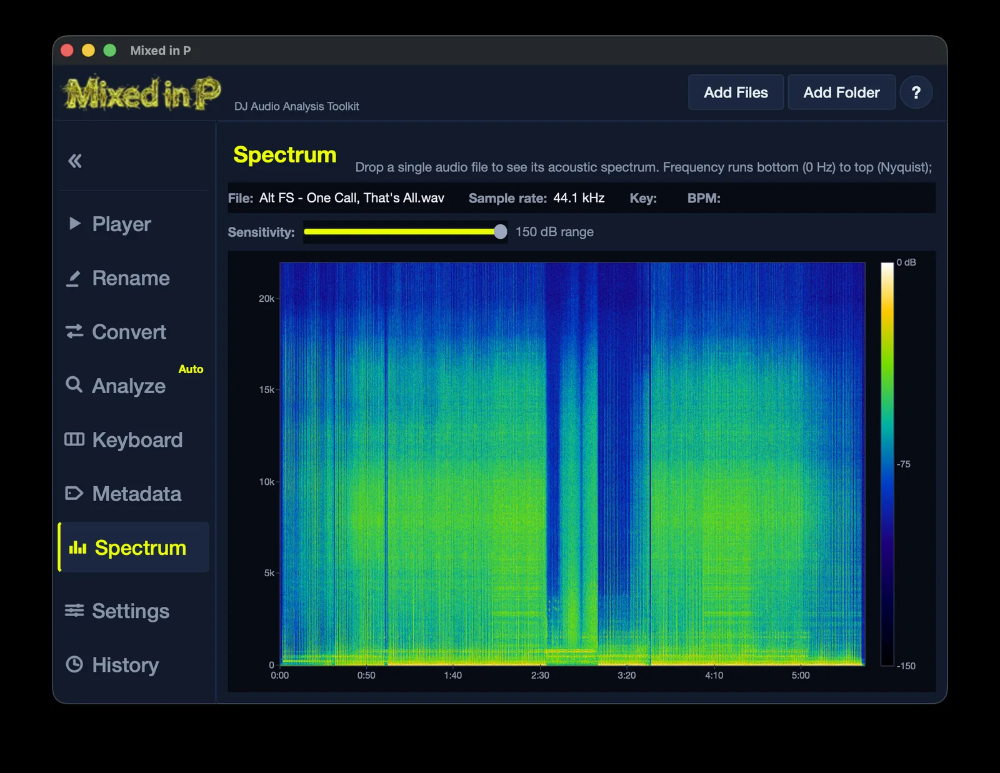

# Mixed in P

The full audio file preparation workflow for DJs.



## Features

- Batch file renaming with undo
- Audio conversion (MP3/WAV/FLAC/AIFF) — quality is only ever kept or lowered, including same-format downgrades (96k/24-bit FLAC → 44.1k/16-bit FLAC), writing beside each source or into a folder of your choosing, toggled per batch
- Pipeline — one press takes a batch through Convert, then Analyze, then into a playlist, each track landing as its analysis finishes; pick an existing playlist or type a name and one gets made
- Acoustic spectrum analyzer
- Audio Player + Slicer for sample lifting
- Playlist library — folders, saved playlists, a name filter for the tree, search across every playlist at once, export to `.m3u8`/`.m3u`/tracklist, and Shift+Tab to show or hide the tree from anywhere
- Playlist view you can shape — cover art in the list (top / middle / full sleeve), optional Album, Genre, Track #, Label, Bitrate and Energy columns, and Small/Medium/Large text
- Compatible Tracks — what else in your library mixes with the track in the player, ranked by key, tempo (half- and double-time count) and energy, with click-and-hold preview
- "Open with Mixed in P" from Finder or Explorer, and an option to become your default audio player
- Keyboard to play chords for key comparison, with a metronome (tap tempo, time-bend, 2-decimal BPM, its own volume)
- BPM detection using beat tracking (librosa)
- Key detection using chroma analysis
- Energy level detection — written to the comment, to its own tag field, or both
- Live analysis queue with per-track status, and a Cancel that keeps the results already in
- Freeze toggle — analyze and read the results without writing anything to your files
- Auto-write metadata to file tags & Manual metadata editing, with the full path of the file you're editing and a jump to it in Finder/Explorer
- Online lookup (opt-in) — fill in title, artist, album, label, genre, year, track number and cover art from Discogs, one file or a whole selection, with every value reviewed before anything is written. Off by default; BPM, key and energy always come from your own analysis
- Player visualizations — six of them behind the playlist or in their own window, including a nebula tunnel that turns on the beat of the track it is playing
- Dark/Light modes and waveform color customization

## Install

```bash
python -m venv venv
# Windows
venv\Scripts\activate
# macOS/Linux
source venv/bin/activate

pip install -r requirements.txt
```

## Run

```bash
python -m src.main
```

Or use the launcher scripts:
- Windows: `run_app.bat`
- macOS/Linux: `./run_app.sh`

## CLI

```bash
mixed-in-p analyze path/to/music/
mixed-in-p rename path/to/music/ --add-bpm --add-key
```

## Build

```bash
pip install pyinstaller
pyinstaller mixedinp.spec
```

Output: `dist/MixedInP/`

## Supported Formats

MP3, WAV, FLAC, AIFF, M4A, OGG

## License

MIT
