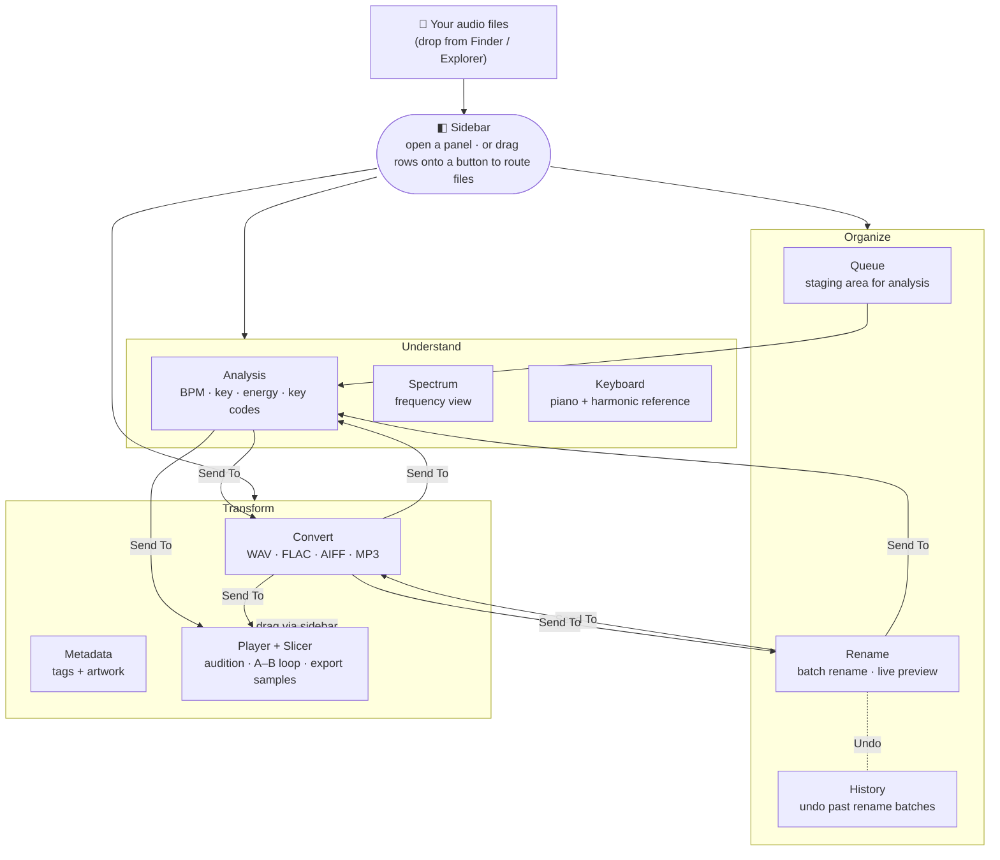
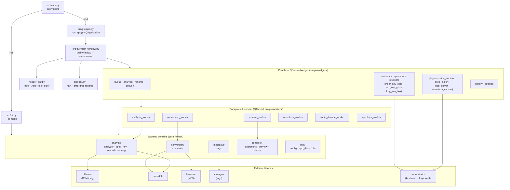

# Mixed in P — Diagrams

Two views of the app:

1. **Feature & workflow map** — for anyone learning what the app does and how
   files flow between its panels.
2. **Technical architecture** — for contributors: the code layers from entry
   point down to the audio libraries.

> This file supersedes the older diagram in
> `spitball/2026-05-29-app-structure.md`, which predates the embedded Player
> slicer and the Spectrum / Queue panels.

---

## 1. Feature & workflow map

How you move through the app. The **sidebar** is the hub: click a button to open
a panel, or drag selected rows onto a button to send files there. You can also
drop files straight from Finder/Explorer onto any panel.

**Routing in plain terms**

- **Drop anywhere** — drag files from your file manager onto a panel to load
  them there.
- **Send To menus** — Rename can send to Analyze or Convert; Convert can send to
  Analyze, Rename, or Player; Analysis can send to Convert or Player.
- **Sidebar drag** — select rows in a panel and drop them on another panel's
  sidebar button to route them (some routes *move* the files, others *copy*).

---

## 2. Technical architecture

The code is layered: PySide6 panels at the top, background `QThread` workers
that keep the UI responsive, pure-Python backend domains, and the third-party
audio libraries underneath.

**State & models** — `src/gui/models/`: a shared `TrackStore`
(`track_model.py`) backs the Queue/Analysis/Rename panels and emits
add/update/remove signals; `state.py` defines the track lifecycle
(QUEUED → PENDING → ANALYSING → ANALYSED / ERROR). The Convert panel keeps its
own independent file list.
